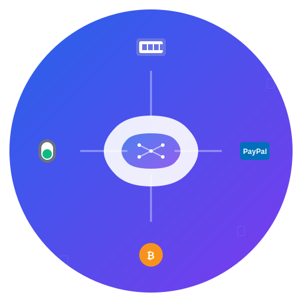

# Announcing aiagent_payments: A Unified Payment SDK for AI Applications

<div align="center">
  
  <h3>Simplify Payment Processing for AI Applications</h3>
</div>

*Posted on July 2025*

## Introduction

Today, I'm excited to announce the release of **aiagent_payments**, an open-source Python SDK designed to simplify payment processing for AI applications, SaaS platforms, and developers building monetized services.

## The Problem We're Solving

As AI applications become more sophisticated, developers face a common challenge: **how to monetize their services effectively**. Whether you're building:

- AI-powered APIs that charge per request
- SaaS platforms with subscription models
- AI agents that need to process payments
- Usage-based billing systems

You typically end up writing custom integration code for each payment provider (Stripe, PayPal, etc.), dealing with webhooks, handling refunds, and managing complex billing logic. This is time-consuming, error-prone, and diverts focus from your core product.

## What is aiagent_payments?

`aiagent_payments` is a unified Python SDK that provides a clean, consistent interface for multiple payment providers. Instead of writing separate integration code for each provider, you get a single API that handles the complexities while providing production-ready features.

### Key Features

**🔌 Multiple Payment Providers**
- **Stripe** - Traditional card payments, subscriptions, and stablecoins
- **PayPal** - PayPal and Venmo transactions
- **Crypto (USDT ERC-20)** - Blockchain-based payments
- **Mock Provider** - For development and testing

**💾 Flexible Storage Options**
- **Memory Storage** - For development and testing
- **File Storage** - Simple JSON-based persistence
- **Database Storage** - SQLite/PostgreSQL with transaction support

**📊 Built-in Billing Models**
- **Subscription Management** - SDK-managed subscriptions (not Stripe subscriptions)
- **Usage-Based Billing** - Perfect for AI API monetization
- **Freemium Models** - Tiered access control

**🛡️ Production-Ready Features**
- Comprehensive error handling and validation
- Health monitoring for all components
- Webhook support for Stripe and PayPal
- Robust logging and security features
- Capability reporting for providers and storage

## Architecture Overview

### System Architecture

```
┌─────────────────────────────────────────────────────────────┐
│                    Application Layer                        │
├─────────────────────────────────────────────────────────────┤
│  PaymentManager  │  UsageTracker  │  SubscriptionManager   │
├─────────────────────────────────────────────────────────────┤
│                    Provider Layer                           │
├─────────────────────────────────────────────────────────────┤
│  StripeProvider  │  PayPalProvider │  CryptoProvider       │
├─────────────────────────────────────────────────────────────┤
│                    Storage Layer                            │
├─────────────────────────────────────────────────────────────┤
│  MemoryStorage   │  FileStorage   │  DatabaseStorage       │
└─────────────────────────────────────────────────────────────┘
```

### Data Flow

```
User Request → PaymentManager → Provider → Storage
     ↑              ↓              ↓         ↓
   Response ← Transaction ← Payment ← Persist
```

### Component Interaction

```
┌─────────────┐    ┌─────────────┐    ┌─────────────┐
│   Client    │───▶│PaymentManager│───▶│  Provider   │
│             │    │             │    │             │
└─────────────┘    └─────────────┘    └─────────────┘
                          │                   │
                          ▼                   ▼
                   ┌─────────────┐    ┌─────────────┐
                   │   Storage   │    │   External  │
                   │             │    │   Payment   │
                   └─────────────┘    │   Service   │
                                      └─────────────┘
```

## Architecture Decisions

### 1. Provider Abstraction Pattern

**Decision:** Use abstract base classes for all payment providers
**Rationale:** Ensures consistent interface across different payment systems while allowing provider-specific optimizations
**Benefits:** Easy to add new providers, consistent API, testable with mocks

```python
class PaymentProvider(ABC):
    @abstractmethod
    async def process_payment(self, amount: float, currency: str) -> PaymentTransaction:
        pass
```

### 2. Storage Backend Abstraction

**Decision:** Abstract storage layer with multiple implementations
**Rationale:** Different deployment scenarios require different storage solutions
**Benefits:** Development with memory storage, production with database, easy migration

### 3. Capability Reporting

**Decision:** Each provider reports its capabilities at runtime
**Rationale:** Payment providers have different feature sets and limitations
**Benefits:** Graceful degradation, feature detection, better error handling

### 4. Transaction-First Design

**Decision:** All operations create or modify transaction records
**Rationale:** Payment processing requires audit trails and consistency
**Benefits:** Complete transaction history, debugging, compliance

### 5. Health Monitoring

**Decision:** Built-in health checks for all components
**Rationale:** Payment systems require high availability and monitoring
**Benefits:** Proactive issue detection, operational visibility

## Quick Start

```python
from aiagent_payments import PaymentManager, PaymentPlan
from aiagent_payments.providers import create_payment_provider
from aiagent_payments.storage import MemoryStorage
from aiagent_payments.models import PaymentType, BillingPeriod

# Define a payment plan
plan = PaymentPlan(
    id="pro",
    name="Pro Plan",
    payment_type=PaymentType.SUBSCRIPTION,
    price=10.0,
    currency="USD",
    billing_period=BillingPeriod.MONTHLY,
    features=["premium_api", "priority_support"]
)

# Setup manager
provider = create_payment_provider("stripe", api_key="sk_test_...")
storage = MemoryStorage()
manager = PaymentManager(storage=storage, payment_provider=provider)

# Create the plan
manager.create_payment_plan(plan)

# Subscribe a user
manager.subscribe_user("user@example.com", plan_id="pro")

# Check access
if manager.check_access("user@example.com", "premium_api"):
    # Provide premium feature
    pass
```

## Real-World Use Cases

### 1. AI API Monetization

Perfect for charging per API call or usage:

```python
# Track usage and bill accordingly
manager.record_usage("user@example.com", "api_calls", 1, cost=0.01)

# Check if user has sufficient credits
if manager.check_access("user@example.com", "api_calls"):
    # Process AI request
    response = ai_model.generate(prompt)
    return response
```

### 2. SaaS Subscription Management

Handle subscriptions with built-in billing logic:

```python
# Subscribe user to a plan
manager.subscribe_user("user@example.com", plan_id="enterprise")

# Check subscription status
if manager.is_subscribed("user@example.com", plan_id="enterprise"):
    # Provide enterprise features
    pass
```

### 3. AI Agent Payments

Enable AI agents to process payments:

```python
# Process payment for AI service
transaction = provider.process_payment(
    user_id="user@example.com",
    amount=5.99,
    currency="USD",
    description="AI analysis service"
)

# Verify payment
if provider.verify_payment(transaction.id):
    # Deliver AI service
    pass
```

## Advanced Features

### Stripe Integration

**Checkout Sessions** - Generate hosted payment pages:
```python
checkout_result = stripe_provider.create_checkout_session(
    user_id="user@example.com",
    plan=plan,
    success_url="https://yourapp.com/success",
    cancel_url="https://yourapp.com/cancel"
)
checkout_url = checkout_result["url"]
```

**Stablecoin Payments** - Accept cryptocurrency:
```python
transaction = stripe_provider.process_stablecoin_payment(
    user_id="user@example.com",
    amount=25.00,
    currency="USD",
    stablecoin="usdc"
)
```

### PayPal Integration

**Two-step payment flow** for better user experience:
```python
# Step 1: Create order
order = paypal_provider.create_order(
    user_id="user@example.com",
    amount=10.00,
    currency="USD"
)

# Step 2: Capture payment
transaction = paypal_provider.capture_order(order["id"])
```

### Crypto Payments

**USDT ERC-20 payments** with blockchain verification:
```python
transaction = crypto_provider.process_payment(
    user_id="user@example.com",
    amount=50.00,
    currency="USD"
)
```

## Architecture Highlights

### Modular Design

All providers and storage backends are pluggable and can be enabled/disabled via configuration:

```python
# Enable only what you need
ENABLED_PROVIDERS = ["stripe", "mock"]
ENABLED_STORAGE = ["database"]
```

### Health Monitoring

Built-in health checks for all components:

```python
# Check provider health
status = stripe_provider.health_check()
print(f"Provider healthy: {status}")

# Check storage health
status = storage.health_check()
print(f"Storage healthy: {status}")
```

### Error Handling

Comprehensive error handling with retry logic:

```python
try:
    transaction = provider.process_payment(...)
except PaymentFailed as e:
    logger.error(f"Payment failed: {e}")
    # Handle gracefully
except ValidationError as e:
    logger.error(f"Validation error: {e}")
    # Fix input data
```

## Installation

```bash
pip install aiagent_payments
```

**Optional extras:**
- `stripe` - For Stripe integration
- `paypalrestsdk` - For PayPal integration  
- `web3` - For crypto payments
- `sqlalchemy` - For database storage

## Current Status

**Version:** 0.0.1-beta

**What's Working:**
- ✅ Core payment processing across all providers
- ✅ Usage-based billing and subscription management
- ✅ Comprehensive test suite with mock providers
- ✅ Production-ready error handling and validation
- ✅ Health monitoring and capability reporting
- ✅ Extensive documentation and examples

**Known Limitations:**
- Limited production testing with real payment volumes

**Why Beta?**
Financial software requires higher standards than typical applications. While the code is well-tested and follows best practices, we're being conservative about production readiness until we have more real-world usage data.

## Getting Started

1. **Install the SDK:**
   ```bash
   pip install aiagent_payments
   ```

2. **Set up your first payment:**
   ```python
   from aiagent_payments import PaymentManager
   from aiagent_payments.providers import create_payment_provider
   
   provider = create_payment_provider("mock")  # Start with mock for testing
   manager = PaymentManager(payment_provider=provider)
   ```

3. **Check out the examples:**
   - [Basic Usage](examples/basic/basic_usage.py)
   - [Advanced Usage](examples/advanced/advanced_usage.py)
   - [Real-world Billing](examples/real_world/usage_based_billing.py)

## Contributing

We welcome contributions! The project is open source and actively developed. Areas where we'd love help:

- **Testing** - More comprehensive test coverage
- **Documentation** - Additional examples and guides
- **New Providers** - Integration with other payment systems
- **Performance** - Optimization for high-throughput scenarios
- **Security** - Security audits and improvements

## Roadmap

**Short-term (3-6 months):**
- Additional payment provider support
- Enhanced currency support for crypto providers
- Performance optimizations
- JavaScript SDK

**Medium-term (6-12 months):**
- Multi-currency support with automatic conversion
- Advanced fraud detection
- Enterprise features (multi-tenancy, audit trails)
- SDKs for other languages (Go, Rust)

**Long-term (1+ years):**
- AI/ML integration for fraud detection
- Marketplace for payment provider plugins
- Advanced analytics and reporting

## Why Open Source?

Payment processing is critical infrastructure that should be transparent and auditable. By open-sourcing this SDK, we're:

- **Building Trust** - Full transparency into how payments are handled
- **Enabling Innovation** - Developers can extend and customize as needed
- **Reducing Vendor Lock-in** - No dependency on proprietary solutions
- **Fostering Community** - Collaborative development and knowledge sharing

## Conclusion

`aiagent_payments` represents a step toward simplifying payment processing for AI applications and developers. While it's still in beta, it provides a solid foundation for building monetized services without the complexity of custom payment integrations.

Whether you're building an AI API, SaaS platform, or any application that needs payment processing, `aiagent_payments` can help you focus on your core product while handling the complexities of payments.

**Get started today:**
- [GitHub Repository](https://github.com/cmaliwal/aiagent-payments)
- [Documentation](https://github.com/cmaliwal/aiagent-payments/wiki)
- [Examples](https://github.com/cmaliwal/aiagent-payments/tree/main/examples)

We'd love to hear your feedback, contributions, and use cases. Join us in building better payment infrastructure for AI applications!

---

*This blog post reflects the current state of aiagent_payments as of July 2025. The project is actively developed and features may be added or modified.* 