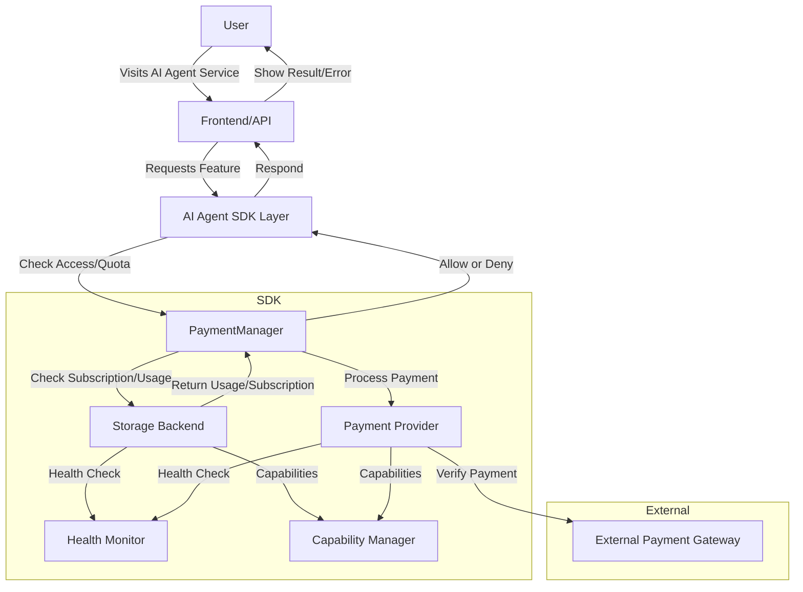
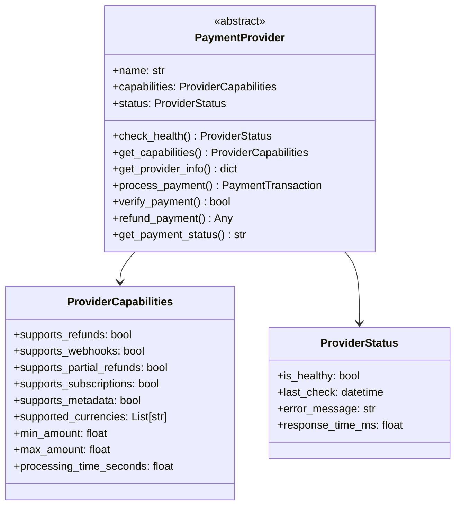
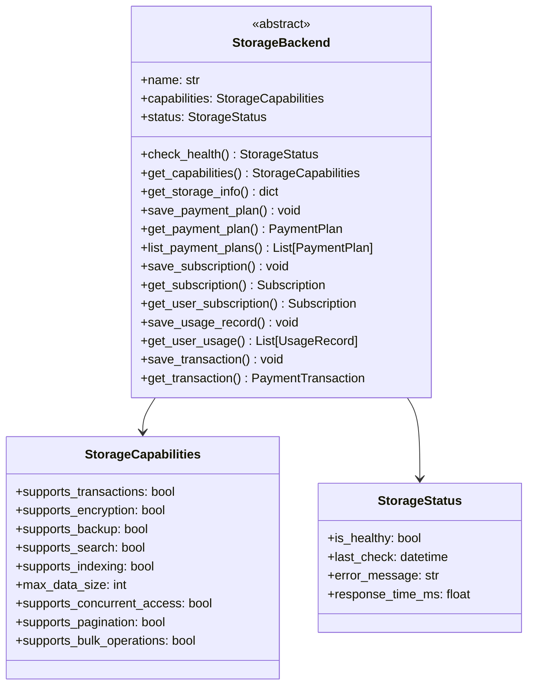
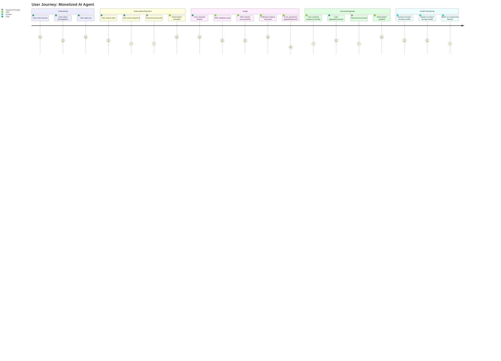
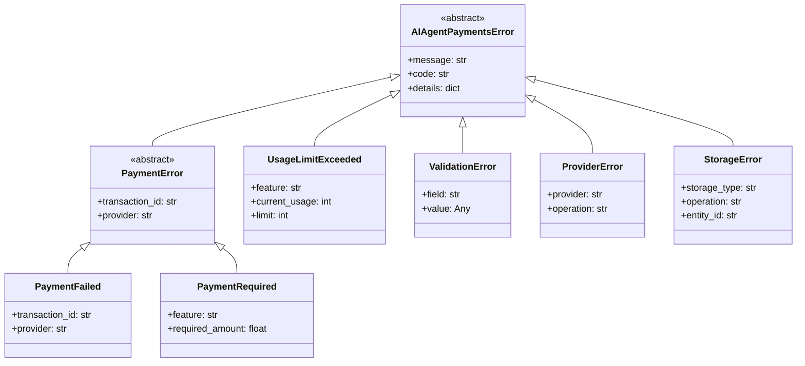

# AI Agent Payments SDK Architecture

## System Architecture



**Explanation:**
- **User** interacts with your AI agent via a frontend or API.
- **Frontend/API** sends feature requests to the SDK layer.
- **AI Agent SDK Layer** (your code + SDK) checks access, quota, and payment status.
- **PaymentManager** coordinates access control, usage, and payment logic with enhanced validation.
- **Storage Backend** (memory, file, or database) stores plans, subscriptions, and usage. Only enabled storage backends are available.
- **Payment Provider** (Stripe, PayPal, Crypto, etc.) processes payments. Only enabled providers are available.
- **Health Monitor** provides real-time health status for all components.
- **Capability Manager** reports supported features for each component.
- **External Payment Gateway** is the actual payment network (Stripe, PayPal, blockchain, etc.).

---

## Enhanced Component Design

### Payment Provider Architecture



### Storage Backend Architecture



---

## User Journey



**Explanation:**
- **Onboarding:** User discovers your service, reviews plans, and signs up.
- **Subscription/Payment:** User selects a plan, enters payment, and the SDK activates their subscription after payment is processed.
- **Usage:** User requests features; SDK validates input, checks access/quota and either allows usage or prompts for upgrade/payment.
- **Renewal/Upgrade:** SDK reminds user to renew; user can upgrade/cancel; payment is processed and subscription is updated.
- **Health Monitoring:** System continuously monitors the health of all components and alerts on failures.
- **Compliance:** If a disabled provider/storage is selected, the SDK will raise an error and log a warning. Only enabled providers/storage are importable and usable; others will raise errors if used.

---

## Configuration Management

The SDK uses a robust configuration system that allows fine-grained control over which components are available:

```python
# Configuration can be set via environment variables
export AIAgentPayments_EnabledStorage="memory,file,database"
export AIAgentPayments_EnabledProviders="mock,stripe,paypal,crypto"

# Or via code
from aiagent_payments.config import ENABLED_STORAGE, ENABLED_PROVIDERS
ENABLED_STORAGE = ["memory", "file", "database"]
ENABLED_PROVIDERS = ["mock", "stripe", "paypal", "crypto"]
```

This ensures that:
- Only enabled components are importable
- Disabled components raise clear errors if accessed
- Configuration is validated at startup
- Production deployments can restrict functionality as needed

---

## Error Handling and Validation

The SDK implements comprehensive error handling and validation:

### Exception Hierarchy



### Input Validation

All public methods now include comprehensive input validation:
- Empty or invalid user IDs
- Empty or invalid feature names
- Invalid payment amounts
- Invalid currency codes
- Invalid configuration parameters

### Health Monitoring

Each component provides health monitoring capabilities:
- **Payment Providers:** Check API connectivity, response times, and account status
- **Storage Backends:** Check data integrity, connection status, and performance
- **Automatic Monitoring:** Components can be monitored continuously for production deployments

---

## Performance and Scalability

### Caching and Optimization

- **Memory Storage:** Fast in-memory operations for development and testing
- **File Storage:** Efficient JSON-based storage with lazy loading
- **Database Storage:** Optimized SQLite with indexing and transaction support

### Concurrent Access

- **Thread Safety:** Storage backends support concurrent access where possible
- **Connection Pooling:** Database storage uses connection pooling for efficiency
- **Atomic Operations:** Critical operations use transactions where supported

### Monitoring and Observability

- **Structured Logging:** All operations are logged with structured data
- **Performance Metrics:** Response times and throughput are tracked
- **Health Checks:** Real-time health status for all components
- **Error Tracking:** Comprehensive error reporting with context 

- For USDT ERC-20 payments, the system requires the user to provide the sender's Ethereum address (sender_address) in the payment metadata. Payments are only credited if the funds are sent from this address. 